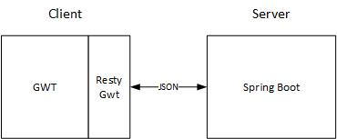

# Spring Boot GWT

[](https://spring-boot-gwt.herokuapp.com/)
[](https://travis-ci.org/feedm3/spring-boot-gwt)
[](http://badges.mit-license.org)
[](https://dependencyci.com/github/feedm3/spring-boot-gwt)
[](https://img.shields.io/badge/Actively%20Maintained-%E2%9C%94-brightgreen.svg?style=flat-square)

[](https://heroku.com/deploy?template=https://github.com/feedm3/spring-boot-gwt/blob/master)

This is a demo project to show Spring Boot in conjunction with GWT. It uses the latest dependencies
(Spring Boot 1.4.1 and GWT 2.8 RC2) and Java 8. The deployed app can be found [here](https://spring-boot-gwt.herokuapp.com/).

## Run

To run this project you have to start Spring Boot and GWT separate. If you use IntelliJ the run configurations
to do this are already present in this repo. _Note that you have to set the path to the static html file in your project strutures "Web" module to the [`static/resource`](src/main/resources/static) folder. Otherwise GWT will not find the index.html._

Spring Boot can also be started with gradle.

```
gradlew bootRun
```

## Test

Currently only the server side code is tested. To run the tests use the following command

```
gradlew test
```

We use [Spock](https://github.com/spockframework/spock) as testing framework because of the great
readability, syntax and built in features.

#### Outdated dependencies

To check for outdated dependencies
```
gradlew dependencyUpdates -Drevision=release
```

## Build

The project con be build to a single jar file with an embedded tomcat:

```
gradlew build
```

After gradle build the project the finished jar file is in `build/libs/spring-boot-gwt-1.0.0.jar`
and can simply be started with

```
java -jar spring-boot-gwt-1.0.0.jar
```

### Heroku

To deploy this app to heroku use the __Deploy to Heroku__ Button on the top.

Heroku uses the gradle `stage` task to build the project. Because Spring Boot puts everything we
need into the jar file we only have to tell heroku to execute this jar file.

## Technical Details



The client side and server side are strictly separated. The GWT files are in the `client` package
(except the `.gwt.xml`) and the server side code is in the `server` package. All static client code
like the `index.html` and css files are inside the [`static`](src/main/resources/static) folder. Gradle
will also put the compiled sources in this folder.

The communication is made via JSON for which reason we have make 2 implementations of the object we
send (POJO in the frontend and POJO with javax annotations in the backend).
